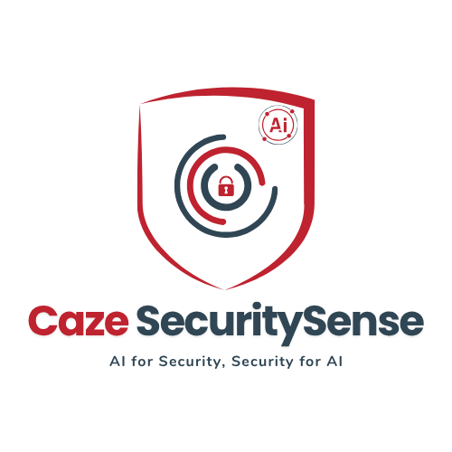
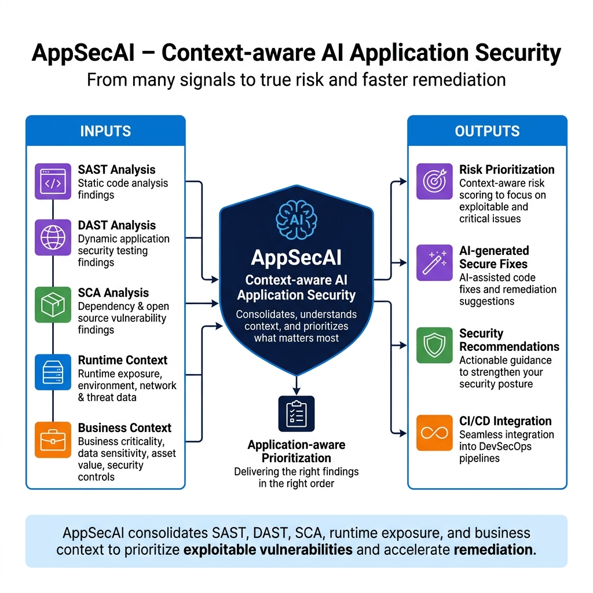

<div align="center">
  

  # AppSecAI

  **AI-native application security platform for context-aware vulnerability prioritization and remediation.**
</div>


AppSecAI helps security and development teams analyze, prioritize, and remediate vulnerabilities across **SAST**, **DAST**, and **SCA** workflows. It integrates with tools such as **SonarQube**, **OWASP ZAP**, and **Trivy**, applies application-specific context, and helps teams focus on vulnerabilities that matter most.

---

## What is AppSecAI?

AppSecAI reduces security noise by combining scanner findings with application context such as runtime exposure, business criticality, deployment environment, security controls, dependency usage, exploitability, and data sensitivity.
It provides:
- Context-aware vulnerability prioritization
- AI-generated secure code fixes
- AI-driven security recommendations
- Developer-friendly CLI workflows
- Security posture reporting

---

## Key Problems AppSecAI Solves
- **Vulnerability noise:** Prioritizes findings based on real-world risk instead of raw scanner severity alone.
- **Slow triage:** Provides risk scores, justification, and context to speed up vulnerability review.
- **Delayed remediation:** Generates secure fixes and actionable recommendations to help teams move faster.
- **Tool fragmentation:** Consolidates findings from SAST, DAST, and SCA tools into a unified risk view.
- **Lack of application context:** Aligns prioritization with application exposure, business impact, and security controls.

---

## Key Features

- Context-aware vulnerability prioritization
- SAST, DAST, and SCA analysis support
- SonarQube integration for SAST
- AppSecAI install and integrate OWASP ZAP for DAST
- AppSecAI install and integrate Trivy for SCA
- AI-generated secure code fixes
- AI-driven security recommendations
- CLI-based execution
- JSON-based configuration
- Risk score calculation
- Security posture report generation
- Support for local and configurable execution environments

---
## AppSecAI Platform Overview

AppSecAI consolidates SAST, DAST, SCA, runtime exposure, and business context to prioritize exploitable vulnerabilities and accelerate remediation.




---

## Getting Started


### Prerequisites
Depending on the workflow, install and configure:
- SonarQube for SAST
- Python 3.10+
- Optional GitHub/GitLab access for pull request workflows

### Installation
```bash
git clone https://github.com/[org]/appsecai.git
cd appsecai
pip install -r requirements.txt
```

### Running AppSecAI
The easiest way to start is using the interactive menu:

```bash
python -m appsecai.cli.menu
```

From the menu, you can select:
1. **Run Scan using Configuration File**: AppSecAI will read scanner configuration and application context from the configuration file.
2. **Configure & Run Scan**: Use this option to configure scan targets directly from the CLI.Refer user guide for more details

---

## Reports

AppSecAI generates comprehensive security posture reports in PDF, HTML, and CSV formats, including:
- Total findings across all layers
- Prioritized findings with risk scores
- Contextual justification for prioritization
- AI-driven remediation recommendations
- Security posture trends and summaries

---

## Project Status

AppSecAI is under active development. Current focus areas include:
- Improving prioritization accuracy
- Enhancing SAST, DAST, and SCA workflows
- Improving CLI usability
- Adding cross-platform package support
- Expanding reporting capabilities

---

## Roadmap

- Advanced automated contextual scoring
- Improved AI remediation workflows
- CI/CD pipeline integration (GitHub Actions, Jenkins)
- SBOM (Software Bill of Materials) generation
- Additional scanner integrations (Snyk, Checkmarx, etc.)
- Enhanced web-based dashboard

---

## Community and Contributions

Contributions are welcome in areas such as scanner integrations, risk scoring improvements, documentation, and AI prompt engineering.

### How to Contribute
1. Fork the repository
2. Create a feature branch (`git checkout -b feature/my-contribution`)
3. Make your changes
4. Submit a pull request

---

## License

AppSecAI is released under the **Apache-2.0 License**. Please review the [LICENSE](LICENSE) file for details.

---

## Terms of Usage

AppSecAI is intended for authorized security testing, vulnerability analysis, prioritization, and remediation activities only.
Users are responsible for ensuring that AppSecAI is used only on applications, repositories, systems, and environments for which they have explicit authorization. Unauthorized scanning or analysis of third-party systems is strictly prohibited.
Security findings, AI-generated fixes, prioritization scores, and remediation recommendations should be reviewed and validated by qualified security and development teams before production deployment.
AppSecAI is provided on an “as-is” basis without warranties or guarantees of any kind.
For detailed licensing and usage conditions, please refer to the `LICENSE` and `TERMS_OF_USAGE` files.
For more information, visit:
https://www.cazelabs.com
